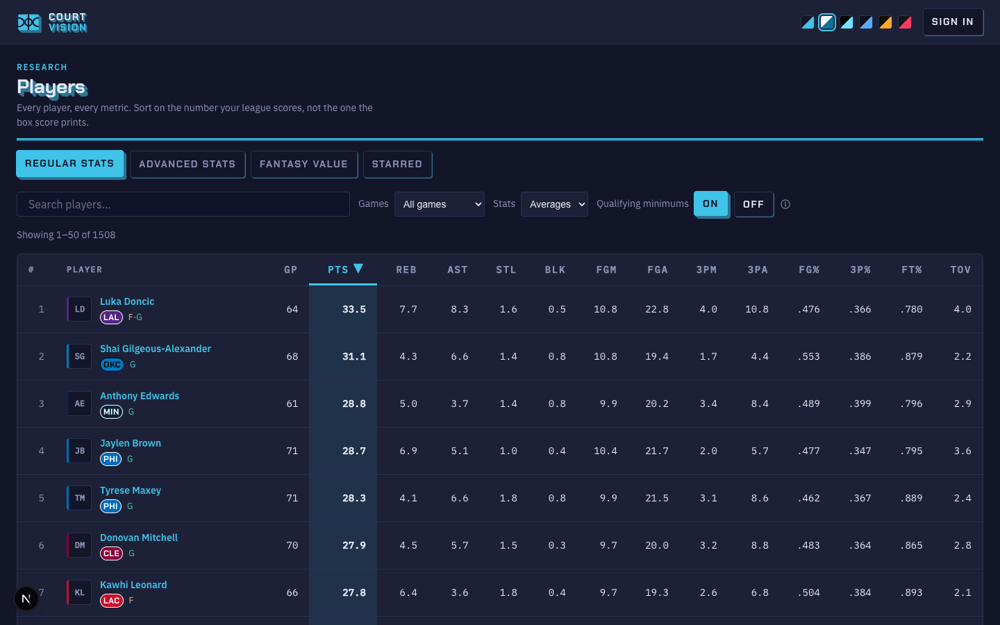
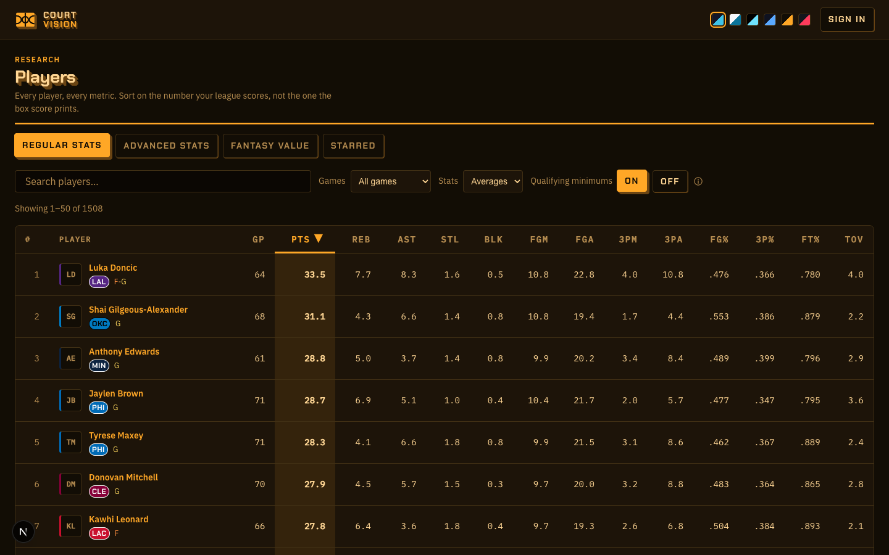
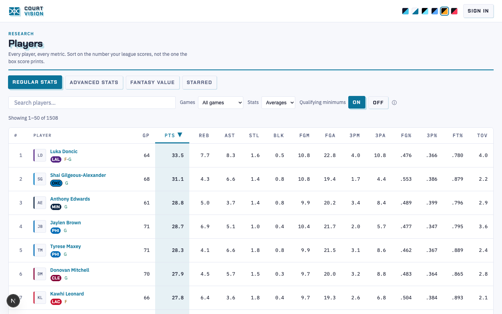
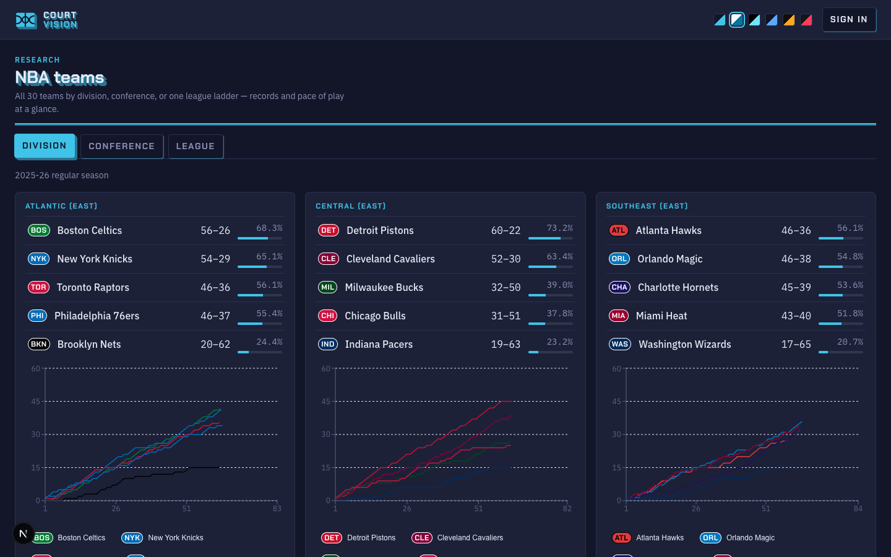
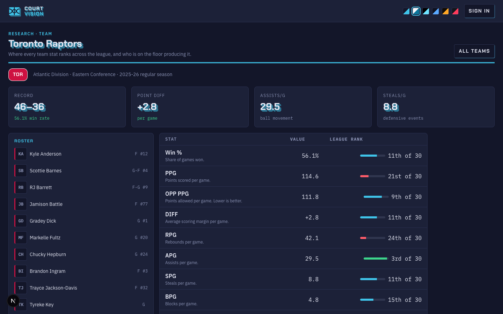
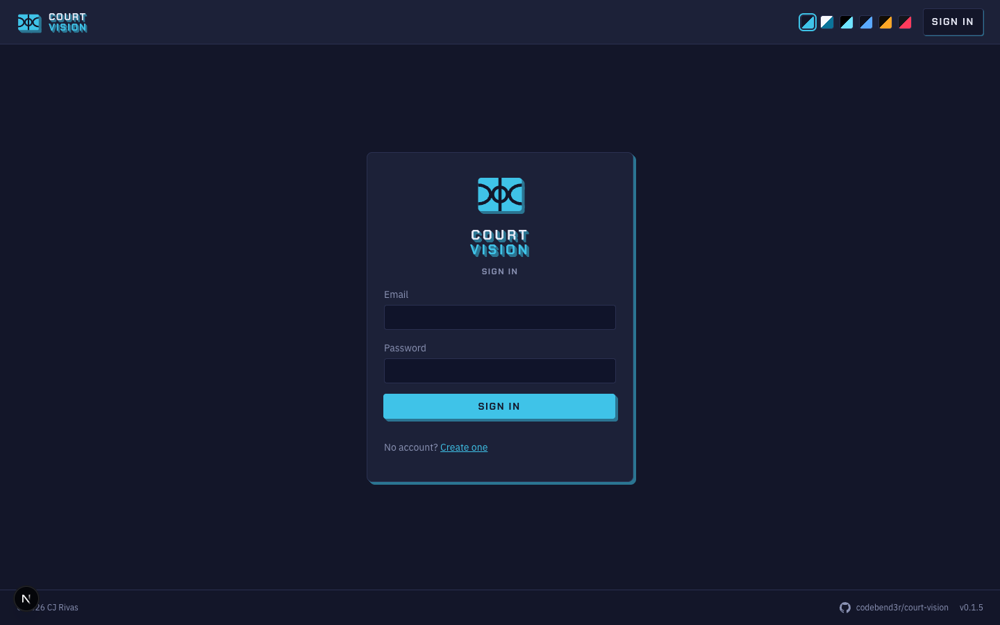

# Court Vision

Find fantasy basketball players trending in the categories you care about.

Court Vision pulls NBA player stats (2020–2025 seasons via the Balldontlie
API, stored in Postgres through Prisma) and turns them into sortable,
filterable views for fantasy decisions.

## What's built today

- **`/players`** — three tabs over the same searchable table shell:
  - **Regular Stats** — per-game or total box-score stats, lastN game
    windows, NBA qualifying minimums.
  - **Advanced Stats** — 15 per-game advanced metrics (TS%, PIE, usage, …)
    with explain-in-place header tooltips and a legend.
  - **Fantasy Value** — the multi-method valuation engine
    ([`docs/prd/valuation-engine.md`](docs/prd/valuation-engine.md)): one sortable column per method —
    **Z-Score**, **G-Score** (game-to-game volatility aware), **Points**
    (points-league scoring), **VORP**, and **Pos VORP** (positional
    scarcity), plus a placeholder for SGP. Punt or weight categories,
    tune league size, and every score recomputes instantly client-side;
    the whole view lives in the URL.
- **`/players/[playerId]`** — player detail with season averages, game log,
  and stat charts.
- **`/teams`** — all 30 teams grouped by division, conference, or one league
  standings list; each team links to **`/team?is=<nickname>`** (e.g.
  `/team?is=raptors`), which shows the team's season stats and where each
  ranks across the league.
- **Auth** — Supabase email/password signup/login with per-user profiles.
- **Six themes** — dark, light, high contrast, colorblind-safe (blue/amber),
  amber CRT, and team accent, switchable from the header swatch strip or
  Settings. Themes redefine color tokens only; spacing, type, and the retro
  shadow geometry are shared constants.
- **A deliberate retro language** — one keycap mechanic for every pressable
  control, extrusion reserved for page titles and big readout numbers, and an
  inline SVG logo that re-inks per theme.

Still to come: the heat-score trending leaderboard, SGP (needs a sourced
standings-gain table), and auction dollar values.

## Screenshots

The 2026-08 redesign (spec: `docs/superpowers/specs/redesign-2026-08.md`,
prototypes: `docs/design/prototypes/`).

|                                                             |                                                                     |
| ----------------------------------------------------------- | ------------------------------------------------------------------- |
|    |  |
| Players — dark                                              | Players — amber CRT                                                 |
|  |                |
| Players — light                                             | Teams — division ladders                                            |
|        |                        |
| Team detail — readouts and rank bars                        | Sign in — the keycap and extrusion language                         |

## Design system

The component library is published to Claude Design as a design-system project:
[claude.ai/design/p/9fa09c9e-0ef3-49b5-8342-277b4eede6a0](https://claude.ai/design/p/9fa09c9e-0ef3-49b5-8342-277b4eede6a0).

It carries the real compiled components, their prop contracts, and the token
stylesheet, so designs built there map straight back onto this codebase. Run
`/design-sync` in Claude Code to refresh it. Config, build inputs, authored
previews, and sync notes live in `.design-sync/`; usage conventions for anyone
(or anything) composing with the components are in
`.design-sync/conventions.md`.

## Repository layout

An [Nx](https://nx.dev/) monorepo on Bun workspaces:

```
apps/court-vision/     the Court Vision Next.js app (UI, server actions, Prisma, auth, sync jobs)
libs/vision-core/      @vision/core: sport-agnostic, framework-free logic driven by a sport descriptor
libs/sport-basketball/ @vision/sport-basketball: the basketball descriptor and the engine bound to it
libs/vision-testing/   @vision/testing: the shared bun:test preload and helpers
```

Shared `@vision/*` libraries hold the sport-agnostic logic so sibling apps
for other sports can reuse it. They ship TypeScript source, and apps compile
them directly; there is no library build step.

## Getting started

You'll need [Bun](https://bun.sh/) installed.

```bash
bun install                                                # install every workspace
cp apps/court-vision/.env.example apps/court-vision/.env   # fill in the values you need
bun dev                                                    # http://localhost:46644
```

Then open [http://localhost:46644](http://localhost:46644) in your browser.

Root scripts run across the whole workspace: `bun run test`, `bun run typecheck`
and `bun run build` fan out with `nx run-many`, and `bun run lint` and
`bun run format` cover every project. App-specific scripts are forwarded from
the root too: `bun run test:a11y`, `bun run perf:budget`, `bun run db:migrate`,
and the sync jobs (`bun run sync:bdl`, then `bun run sync:players`) for
refreshing stats. To target one project, use `bunx nx run <project>:<target>`
(e.g. `bunx nx run court-vision:test`). Install Chromium once with
`bunx playwright install chromium` before running the accessibility suite locally.
Conventions live in `CLAUDE.md`; design specs and plans under `docs/superpowers/`.

## Git hooks

`bun install` installs Lefthook's Git hooks and clears the old Husky
`core.hooksPath` setting. Run `bun run prepare` to reinstall them manually.

- **Pre-commit:** `lint-staged` fixes staged SCSS with Gale, then formats staged
  files with Oxfmt. Partially staged files keep their unstaged changes.
- **Pre-push:** `bun run system-check` checks formatting, types, lint, tests, and
  the production build. Any failure blocks the push; it does not fetch or prune
  remote branches.

Hook configuration lives in `lefthook.yml`; staged-file rules remain in
`.lintstagedrc.json`.

## Accessibility checks

CI runs axe WCAG 2.2 A/AA scans in Chromium against the login, signup, and design
pages in light and dark modes. Playwright also checks keyboard order, visible
focus, and switch operation.

Before a release, manually verify:

- Complete key flows using only the keyboard.
- Check focus order and visibility at 200% zoom.
- Test landmark, heading, label, and status announcements with a screen reader.
- Check light, dark, high-contrast, and reduced-motion settings.
